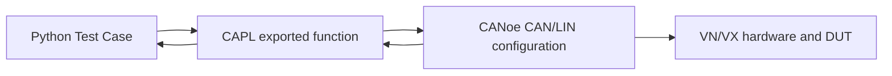

# CAN/LIN Bus Test Framework for CANoe/vTESTstudio

이 폴더는 CANoe/vTESTstudio Test Unit에서 CAN/LIN 테스트 케이스를 재사용하기 위한 기본 프레임워크입니다.

목표는 아래 네 가지 유형의 TC를 한 구조에서 처리하는 것입니다.

- CAN TX/RX
- LIN TX/RX
- 주기 메시지 송신
- 수신 메시지 주기 체크

## 구조

```text
bus_framework/
  bus_framework.vtestunit.yaml
  bus_framework.vtesttree.yaml
  bus_test_cases.py
  bus_test_lib.py
  bus_test_config.py
  bus_bridge_contract.can
```

## 실행 구조



Python은 테스트 시나리오와 판정을 담당합니다. CAN/LIN의 실제 송수신, RX buffering, timer, 주기 측정은 CAPL bridge가 담당합니다.

이 구조를 잡은 이유는 system variable만으로 프레임을 전달하면 여러 RX frame, 빠른 주기, overflow, timestamp 처리가 불편해지기 때문입니다.

## 제공되는 Python TC

`bus_test_cases.py`에는 아래 테스트 케이스가 export되어 있습니다.

| TC | 목적 |
| --- | --- |
| `TC_EXAMPLE_CAN_SendAndExpectResponse` | 사용자가 따라 만들기 쉬운 CAN 송신 후 응답 확인 예제 |
| `TC_EXAMPLE_LIN_RequestAndExpectResponse` | 사용자가 따라 만들기 쉬운 LIN header 요청 후 응답 확인 예제 |
| `TC_EXAMPLE_CAN_PeriodicWhileCheckingResponse` | 주기 CAN 송신을 켠 상태에서 RX 확인하는 예제 |
| `TC_TRACE32_ConnectAndSnapshot` | TRACE32 연결 후 설정된 변수/레지스터 출력 |
| `TC_TRACE32_AssertVariables` | TRACE32 변수 값을 기대값과 비교 |
| `TC_TRACE32_WriteVariables` | TRACE32 변수 값을 변경하고 선택적으로 검증 |
| `TC_CAN_TxThenTrace32Snapshot` | CAN TX 이후 TRACE32 변수/레지스터 snapshot |
| `TC_CAN_RxThenTrace32Snapshot` | CAN RX 이후 TRACE32 변수/레지스터 snapshot |
| `TC_TRACE32_WriteThenCanTx` | TRACE32 변수 변경 후 CAN TX |
| `TC_LIN_RxThenTrace32Snapshot` | LIN RX 이후 TRACE32 변수/레지스터 snapshot |
| `TC_CAN_TxOnce` | CAN frame 1회 송신 |
| `TC_CAN_RxExpect` | CAN frame 수신 대기 및 payload 확인 |
| `TC_CAN_PeriodicTx` | CAN frame을 `duration_ms` 동안 주기 송신 후 정지 |
| `TC_CAN_PeriodicTx_Start` | CAN frame 주기 송신 시작 후 계속 유지 |
| `TC_CAN_PeriodicTx_Stop` | CAN frame 주기 송신 정지 |
| `TC_CAN_PeriodCheck` | CAN frame 수신 주기 측정 및 tolerance 판정 |
| `TC_LIN_TxOnce` | LIN frame/header/data 송신 요청 |
| `TC_LIN_RxExpect` | LIN frame 수신 대기 및 payload 확인 |
| `TC_LIN_PeriodicTx` | LIN header/data를 `duration_ms` 동안 주기 송신 후 정지 |
| `TC_LIN_PeriodicTx_Start` | LIN header/data 주기 송신 시작 후 계속 유지 |
| `TC_LIN_PeriodicTx_Stop` | LIN header/data 주기 송신 정지 |
| `TC_LIN_PeriodCheck` | LIN frame 수신 주기 측정 및 tolerance 판정 |

## 주기 송신 동작

주기 송신은 두 방식으로 사용할 수 있습니다.

1. `TC_CAN_PeriodicTx` / `TC_LIN_PeriodicTx`
   - `period_ms` 간격으로 여러 번 보냅니다.
   - `duration_ms`가 끝나면 TC 내부에서 자동으로 stop합니다.
   - 단독 검증용으로 안전합니다.

2. `TC_CAN_PeriodicTx_Start` + 다른 TC들 + `TC_CAN_PeriodicTx_Stop`
   - Start TC가 주기 송신을 켜고 바로 끝납니다.
   - CANoe/CAPL timer는 계속 동작합니다.
   - 다른 TC를 실행하는 동안에도 주기 메시지가 계속 나갑니다.
   - 마지막에 Stop TC를 실행해서 명시적으로 멈춥니다.

LIN도 `TC_LIN_PeriodicTx_Start` / `TC_LIN_PeriodicTx_Stop`을 같은 방식으로 사용합니다.

## 내 TC를 추가하는 방법

가장 작은 예제는 `simple_user_tc.py`에 있습니다. 새 TC를 만들 때는 이 파일의 함수를 복사해서 이름과 step만 바꾸면 됩니다.

더 자세한 절차는 `docs/how_to_add_simple_tc.md`에 정리되어 있습니다.

## TRACE32 변수/레지스터 snapshot

TRACE32 연동은 옵션 기능입니다.

- 설정 파일: `trace32_config.py`
- 클라이언트 래퍼: `trace32_client.py`
- 예제 TC: `trace32_test_cases.py`

먼저 TRACE32 PowerView Remote API port를 열고, CANoe/vTESTstudio Python runtime에 `lauterbach-trace32-rcl` 패키지를 설치해야 합니다. 자세한 절차는 `docs/trace32_integration_guide.md`에 있습니다.

변수 값 변경은 `trace32_config.py`의 `write_variables`에 등록합니다.

```python
"write_variables": [
    {"name": "gTestMode", "value": 1, "verify": True},
]
```

## 테스트 값 수정

`bus_test_config.py`만 먼저 수정하면 됩니다.

예: CAN RX 주기 체크

```python
"period_check": {
    "id": "0x100",
    "extended": False,
    "expected_period_ms": 10,
    "tolerance_ms": 2,
    "sample_count": 30,
    "timeout_ms": 2000,
}
```

예: LIN RX 확인

```python
"rx_expected": {
    "id": "0x22",
    "data": ["0x55", "0xAA", "0x12", "0x34"],
    "request_header_before_wait": True,
    "check_data": True,
    "timeout_ms": 1000,
}
```

## CAPL bridge 계약

Python은 `bus_bridge_contract.can`의 exported function을 호출합니다.

주요 함수는 다음과 같습니다.

```capl
export long BusBridge_SendCan(...);
export long BusBridge_WaitCan(...);
export long BusBridge_StartCanPeriodic(...);
export long BusBridge_CheckCanPeriod(...);

export long BusBridge_SendLin(...);
export long BusBridge_RequestLinHeader(...);
export long BusBridge_WaitLin(...);
export long BusBridge_StartLinPeriodic(...);
export long BusBridge_CheckLinPeriod(...);

export long BusBridge_StopPeriodic(long taskId);
```

현재 `bus_bridge_contract.can`은 안전한 contract/stub 형태입니다. 실제 프로젝트에서는 이 함수 내부를 CANoe configuration, DBC, LDF, channel, schedule table에 맞게 채워야 합니다.

## CAPL 구현 권장 방식

CAN:

- CAN TX는 CAPL `message` object를 채우고 `output()`으로 송신합니다.
- CAN RX는 `on message *` 또는 named message handler에서 matching ID를 queue에 저장합니다.
- 주기 체크는 CAPL에서 timestamp를 저장하고 interval min/avg/max를 계산합니다.
- Python에는 최종 pass/fail과 통계만 돌려줍니다.

LIN:

- 가능하면 LDF 기반 named frame object를 사용합니다.
- master가 header를 보내야 하는 경우와 slave response data를 준비하는 경우를 분리합니다.
- LIN RX는 `on linFrame ...` 또는 CANoe Test Feature Set wait 기능을 사용해 CAPL 내부 queue에 저장합니다.
- LIN schedule table이 이미 주기를 만들고 있다면 Python은 `CheckLinPeriod`만 호출하게 두는 것이 좋습니다.

## pywin32 / generated type library

현재 Python adapter는 빠른 bring-up을 위해 CANoe COM API의 `CAPL.GetFunction(...).Call(...)`을 사용합니다. 이 방식은 Python runtime에 `pywin32`가 필요합니다.

장기 운용에서는 Vector Test Unit 확장의 Python type library 생성을 사용하는 편이 좋습니다. 그 경우 `bus_test_lib.py`의 `CanoeComCaplBridge` 내부만 생성된 API 호출로 바꾸고, `bus_test_cases.py`는 그대로 유지하면 됩니다.

## CANoe/vTESTstudio에 추가

1. CANoe configuration에서 CAN/LIN channel, DBC/LDF, VN/VX/VT System 연결을 먼저 정상화합니다.
2. `bus_bridge_contract.can`의 stub 함수 내부를 프로젝트에 맞게 구현합니다.
3. CANoe Test Configuration 또는 vTESTstudio workspace에 `bus_framework.vtestunit.yaml`을 추가합니다.
4. VS Code에서 Vector Test Unit 확장으로 Test Unit을 열고 Python/CAPL export table/type library 생성을 확인합니다.
5. `bus_test_config.py`를 DUT와 메시지 정의에 맞게 수정합니다.
6. CANoe measurement를 시작한 뒤 Test Configuration에서 원하는 TC를 실행합니다.

## 실패 시 먼저 볼 것

- `BusBridge_GetLastError=9001`: CAPL bridge 함수가 아직 구현되지 않았습니다.
- Python에서 `pywin32 is not available`: Python runtime에 pywin32가 없거나 generated type library 방식으로 adapter 교체가 필요합니다.
- RX timeout: CANoe trace에서 해당 CAN/LIN frame이 실제로 들어오는지 먼저 확인합니다.
- Period check fail: sample count, timeout, expected period, tolerance가 현실적인지 확인합니다.
- LIN이 동작하지 않음: LDF, schedule table, master/slave 역할, header 송신 주체를 먼저 확인합니다.

CAPL 내부 구현 방향은 `docs/capl_bridge_implementation_guide.md`에 더 자세히 정리되어 있습니다.
