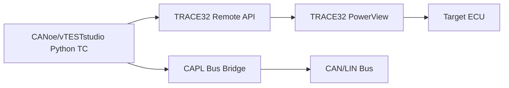

# TRACE32 Integration Guide

이 문서는 CANoe/vTESTstudio Python Test Unit에서 Lauterbach TRACE32 PowerView에 연결해 변수/레지스터 값을 읽는 방법입니다.

## 구조



CAN/LIN bus 테스트와 디버깅 변수 확인을 같은 TC 흐름에서 묶을 수 있습니다.

예:

1. CAN message 송신
2. ECU 내부 변수 `gDiagState` 읽기
3. 기대값과 비교
4. Test Report에 변수 값 기록

## 추가된 파일

```text
canoe_test_unit/bus_framework/
  trace32_config.py
  trace32_client.py
  trace32_test_cases.py
```

`bus_framework.vtestunit.yaml`과 `bus_framework.vtesttree.yaml`에도 이미 등록되어 있습니다.

## 제공 TRACE32 TC

| TC | 목적 |
| --- | --- |
| `TC_TRACE32_ConnectAndSnapshot` | TRACE32 연결 후 설정된 변수/레지스터 출력 |
| `TC_TRACE32_AssertVariables` | 설정된 변수 값을 기대값과 비교 |
| `TC_TRACE32_WriteVariables` | 설정된 TRACE32 변수 값을 변경하고 선택적으로 검증 |
| `TC_CAN_TxThenTrace32Snapshot` | CAN TX 후 TRACE32 snapshot |
| `TC_CAN_RxThenTrace32Snapshot` | CAN RX 후 TRACE32 snapshot |
| `TC_TRACE32_WriteThenCanTx` | TRACE32 변수 변경 후 CAN TX |
| `TC_LIN_RxThenTrace32Snapshot` | LIN RX 후 TRACE32 snapshot |

## 1. TRACE32 PowerView Remote API 포트 열기

TRACE32 PowerView를 Remote API port가 열린 상태로 실행해야 합니다.

T32Start를 쓰는 경우:

1. T32Start에서 사용하는 configuration 선택
2. Advanced settings 열기
3. API Port 항목에서 `Use Port: yes`
4. port를 예: `20000`으로 설정
5. TRACE32 PowerView 실행

직접 `config.t32`를 수정하는 경우 TCP 권장 설정:

```text
RCL=NETTCP
PORT=20000
```

UDP를 쓰는 경우:

```text
RCL=NETASSIST
PORT=20000
PACKLEN=1024
```

## 2. Python 패키지 설치

CANoe/vTESTstudio에서 사용하는 Python runtime에 Lauterbach RCL 패키지를 설치합니다.

먼저 `TC_PYTHON_RuntimeInfo`를 실행해서 실제 `Python executable` 경로를 확인하는 것을 권장합니다. 자세한 절차는 `docs/python_runtime_package_install_guide.md`에 있습니다.

PyPI 사용:

```powershell
py -m pip install "lauterbach-trace32-rcl~=1.1.0"
```

TRACE32 설치 폴더의 wheel 사용:

```powershell
py -m pip install "C:\T32\demo\api\python\rcl\dist\lauterbach_trace32_rcl-1.1.0-py3-none-any.whl"
```

CANoe/vTESTstudio가 별도 Python runtime을 쓰면 그 runtime의 `python.exe -m pip ...`로 설치해야 합니다.

## 3. trace32_config.py 수정

`trace32_config.py`에서 연결 정보와 읽을 변수를 바꿉니다.

```python
TRACE32_CONFIG = {
    "enabled": True,
    "connection": {
        "node": "localhost",
        "port": 20000,
        "protocol": "TCP",
        "timeout_s": 5.0,
    },
    "variables": [
        {"name": "gDiagState", "label": "DiagState"},
        {"name": "gVehicleSpeed", "label": "VehicleSpeed"},
    ],
    "registers": [
        "PC",
        "SP",
    ],
    "assert_variables": [
        {"name": "gDiagState", "expected": 2},
        {"name": "gCurrentA", "expected": 12.5, "tolerance": 0.5},
    ],
    "write_variables": [
        {"name": "gTestMode", "value": 1, "verify": True},
        {"name": "AppState.injectedSpeed", "value": 42, "verify": True},
    ],
}
```

변수 이름은 TRACE32에서 symbol이 로드되어 있어야 읽을 수 있습니다. ELF/AXF가 로드되지 않았거나 최적화로 symbol이 사라진 변수는 실패할 수 있습니다.

## 4. Target halt 여부

기본값은 target을 멈추지 않습니다.

```python
"snapshot": {
    "halt_before_read": False,
    "resume_after_read": False,
}
```

타이밍이 중요한 CAN/LIN 주기 테스트 중에는 target을 멈추면 테스트 결과가 깨질 수 있습니다. 변수 읽기에 target halt가 꼭 필요한 경우에만 아래처럼 바꿉니다.

```python
"snapshot": {
    "halt_before_read": True,
    "resume_after_read": True,
}
```

## 5. 실행 순서

처음 bring-up:

1. TRACE32 PowerView 실행
2. target 연결, ELF/AXF symbol 로드
3. Remote API port 확인
4. `trace32_config.py`의 `variables`에 실제 변수명 1개만 등록
5. CANoe/vTESTstudio에서 `TC_TRACE32_ConnectAndSnapshot` 실행
6. Test Report에 변수 값이 찍히는지 확인

CAN/LIN과 같이 쓰기:

1. CAPL bus bridge가 먼저 동작해야 합니다.
2. `TC_CAN_TxThenTrace32Snapshot` 또는 `TC_LIN_RxThenTrace32Snapshot` 실행
3. bus event 이후 ECU 내부 변수가 바뀌었는지 확인

## 6. 새 TC에서 사용하는 방법

`trace32_test_cases.py` 또는 `simple_user_tc.py`에 아래처럼 추가합니다.

```python
@vector.canoe.tfs.export
@vector.canoe.tfs.test_case
def TC_MY_CAN_And_DebugCheck():
    frame = frame_from_config(CONFIG["can"]["tx_once"])
    bus_bridge().send_can(1, frame)

    values = trace32().snapshot()
    report_debug_values("TRACE32 after CAN", values)
```

특정 변수만 비교:

```python
@vector.canoe.tfs.export
@vector.canoe.tfs.test_case
def TC_MY_DebugAssert():
    trace32().assert_variables([
        {"name": "gDiagState", "expected": 2},
    ])
```

변수 값 변경:

```python
@vector.canoe.tfs.export
@vector.canoe.tfs.test_case
def TC_MY_DebugWrite():
    trace32().write_variables([
        {"name": "gTestMode", "value": 1, "verify": True},
    ])
```

`verify=True`이면 `Var.Set` 이후 같은 변수를 다시 읽어 기대값과 일치하는지 확인합니다. 프로젝트나 TRACE32 버전에 따라 `Var.Assign <expr> = <value>` 형태를 선호하는 경우도 있으므로, 수동 TRACE32 command line에서 먼저 어떤 명령이 동작하는지 확인하세요.

## 7. TRACE32 변수 write 주의사항

TRACE32 변수 변경은 강력하지만 위험할 수 있습니다.

- target 실행 중 변수 write가 허용되지 않는 메모리/변수일 수 있습니다.
- compiler optimization 때문에 변수가 register에 있거나 제거되어 write가 안 될 수 있습니다.
- safety 관련 변수는 ECU 상태를 깨뜨릴 수 있으므로 반드시 테스트 전용 변수부터 확인하세요.
- 주기/타이밍 TC 중 target을 halt하고 write하면 bus timing이 깨질 수 있습니다.

처음에는 아래 순서로 확인하는 것을 권장합니다.

1. TRACE32에서 수동으로 `Var.Set gTestMode=1` 실행
2. `Var.VALUE(gTestMode)` 또는 변수 window에서 값 확인
3. Python `TC_TRACE32_WriteVariables`로 같은 변수 write
4. 이후 CAN/LIN TC와 결합

## 8. 자주 나는 문제

`Python package 'lauterbach-trace32-rcl' is not installed`

CANoe/vTESTstudio가 쓰는 Python runtime에 패키지가 없습니다. 해당 runtime에 설치하세요.

`connection refused` 또는 timeout

TRACE32 PowerView Remote API port가 열려 있지 않거나 port/node가 다릅니다. `config.t32`, T32Start API Port, 방화벽을 확인하세요.

변수 read 실패

TRACE32에 symbol file이 로드되어 있는지, 변수명이 정확한지, 컴파일 최적화로 변수가 제거되지 않았는지 확인하세요.

주기 테스트가 깨짐

`halt_before_read=True`로 target을 멈추면 CAN/LIN 주기 테스트가 깨질 수 있습니다. 주기 테스트 중에는 halt 없이 읽거나, 별도 TC로 분리하세요.

## 참고

- Lauterbach `lauterbach.trace32.rcl`은 TRACE32 Remote API를 사용하는 Python 패키지입니다.
- TRACE32 PowerView Remote API는 TCP/UDP API port를 통해 외부 프로그램에서 target 접근과 debugger 제어를 할 수 있습니다.
